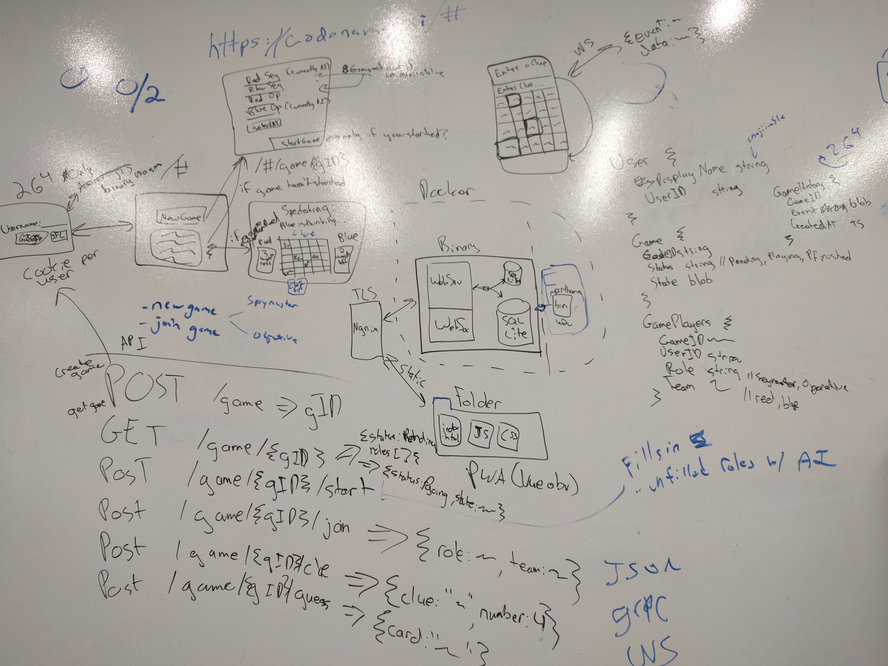

## Original Design

Here's the original design we hacked together an eternity ago.

Some pieces of this are still around, some have gone the way of the dodo. In particular, the following things exist:

- **A web app** - Should be usable on both web and mobile.
- **WebSockets** - Used for sending real-time updates from the web server to
  clients.
- **SQLite DB** - Used for persistence for the web service.
- **Docker** - The web server, Next.js frontend, and (eventually) AI server are
  packaged as Docker containers for deployment.
- **NGINX** - NGINX is no longer used to serve static assets, but is used as a
  reverse proxy to both the Next.js frontend container and the web service
  backend container.
- **Cookies** - Used for authentication, are returned as part of creating a
  user (which just requires a username).

### Basic ideas for UI Screens

This section contains some ideas for UI flows for the web client, which might bear a passing resemblance to what's implemented in the Next.js UI.

1. Username

A user goes to https://codenames.ai/ for the first time. They enter a username. It can have all sorts of cool emojis in it probably. We generate a cookie for the user and persist them to our DB.

2. New Game / Join Game

A button allows the user to create a new game.

There will also be a list of names of existing games that the player can either join (if it hasn't started yet) or spectate. Game "names" are just the IDs, which are formed by taking three random words from the possible set of Codenames word cards.

3. Start Game

When a new game is created, it's in a pending/lobby state. Players (including the game's creator) can join the game at this point. The creator can then start assigning people to roles.

Only the person who created the game can start the game.

The game won't start until all roles are filled. In the future, we'll hopefully have the option to automatically fill any empty roles with AIs.

A spymaster can be only a single person or AI. An operative can be zero or more humans and zero or one AIs. If there are multiple human operatives, a guess is chosen once the majority of operatives have selected the same card. In the future, we'd like to allow human spymasters and operatives to be able to get "Hints" from an AI.

4. Active Game

Spymasters will have a view showing them the board with all the cards highlighted in the right color, and indication of which words have already been guessed, an input for their next clue, and (again, in the future) a way to get a hint/suggestion from the AI.

Operatives will have a view showing them the board with the cards, some indication of which words have been guessed, and the current clue. The cards will be touchable. When a user touches a card, everyone will be able to see who touched which card.

Spectators will have a very similar view to operatives, but it will be read-only.

All the views should probably also clearly indicate who's turn it is, how many cards each team has left. Maybe some sort of history of the game.

### Database

A SQLite database should be hilariously sufficient for our needs, and it keeps
it simple.

- User Table
    - UserId string  // related to the cookie
    - DisplayName string

- Game Table
    - GameId string  // pronounce-able
    - Status string  // enum: Pending, PLaying, PFinished
    - State blob

- GamePlayers Table
    - GameId string
    - UserId string
    - Role string  // Spymaster, Operative
    - Team string  // Red, Blue

- GameHistory Table
    - GameId string
    - EventTimestamp timestamp
    - Event blob

### Web Service API

The Web Service API is a RESTful-ish HTTP/JSON interface, with some WebSockets
sprinkled in for real-time shenanigans. More details about the API can be found
in [the web/ README](/web/README.md).

### Assorted Features and Nice-to-Haves

This is kind of a TODO section.

- Fuzzing
- AI hints for humans
- AI trash talking when humans give clues & guesses.
- A way for users to file feedback
- Spectators are called "Taters" because that's funny
- Supporting >1 human operative on a team (first come first serve for making a guess.)
- AI can play has any combination of spymasters and operatives. It could be all AIs or no AIs.
- Should like reasonable on mobile and on desktop. Would be cool to have a Cast App that shows a spectator screen
